# Lineamientos para Diagramas

## Herramienta obligatoria
- **SIEMPRE usar Mermaid** para todos los diagramas en documentación
- **NO usar** otras herramientas de diagramación (draw.io, Visio, etc.)
- **Integrar diagramas** directamente en archivos Markdown usando bloques de código Mermaid

## Configuración base obligatoria
Todos los diagramas Mermaid DEBEN incluir esta configuración de tema:

```mermaid
%%{init: {'theme':'base', 'themeVariables': {
  'background': '#ffffff',
  'primaryColor': '#f8f9fa',
  'primaryTextColor': '#212529',
  'primaryBorderColor': '#dee2e6',
  'lineColor': '#6c757d'
}}}%%
```

## Buenas prácticas para evitar errores de renderizado

Para prevenir el error "Cannot read properties of undefined (reading 'type')" y otros problemas de renderizado:

### Caracteres y sintaxis a evitar:
- **NO usar dos puntos (:) en nombres de secciones de Gantt**:
  - ❌ `section Feature 1: MVP Evaluador`
  - ✅ `section Feature 1 MVP Evaluador`

- **NO usar barras diagonales (/) en nombres**:
  - ❌ `API/Gateway`
  - ✅ `API Gateway`

- **NO usar paréntesis en nombres de tareas de Gantt**:
  - ❌ `Desarrollo Agente (PoC)`
  - ✅ `Desarrollo Agente PoC`

- **NO usar prefijos con puntos y dos puntos**:
  - ❌ `T1.1: Tarea`
  - ✅ `Tarea`

### Configuraciones problemáticas a evitar:
- **Evitar `axisFormat` en diagramas de Gantt** - puede causar conflictos en algunas versiones
- **Mantener nombres simples** sin caracteres especiales complejos
- **Usar identificadores alfanuméricos** para nodos en lugar de caracteres especiales

### Validación de sintaxis:
- **Probar diagramas** en VS Code antes de commit
- **Simplificar nombres** que contengan múltiples caracteres especiales
- **Usar contenedor HTML con fondo blanco** para garantizar legibilidad
- **Verificar compatibilidad** especialmente en diagramas de Gantt y flowchart complejos

## Configuración avanzada de layout (Para reducir cruces de líneas)

Para diagramas complejos que requieren optimización visual, usar estas configuraciones adicionales:

### Para diagramas C4:
```mermaid
%%{init: {'theme':'base', 'themeVariables': {
  'background': '#ffffff',
  'primaryColor': '#f8f9fa',
  'primaryTextColor': '#212529',
  'primaryBorderColor': '#dee2e6',
  'lineColor': '#6c757d'
}, 'c4': {
  'wrap': true,
  'diagramMarginX': 50,
  'diagramMarginY': 10,
  'c4ShapeMargin': 50,
  'c4ShapeInRow': 3
}, 'flowchart': {
  'nodeSpacing': 50,
  'rankSpacing': 80,
  'curve': 'basis'
}, 'dagre': {
  'rankdir': 'TB',
  'nodesep': 50,
  'ranksep': 80
}}}%%
```

### Principios de optimización de layout:

1. **Agrupar por capas con Boundaries**:
   - `Enterprise_Boundary()` para separar organizaciones
   - `System_Boundary()` para agrupar sistemas relacionados
   - `Container_Boundary()` para capas arquitectónicas (Frontend, Backend, Storage)

2. **Orden estratégico de declaración**:
   - Declarar nodos en el orden visual deseado (arriba → abajo, izquierda → derecha)
   - Dagre respeta bastante el orden de declaración
   - Agrupar elementos por capas lógicas

3. **Usar un diagrama por nivel**:
   - Context → Container → Component (separados)
   - No mezclar "externos + middleware + servicios + repos" en uno
   - Simplifica el procesamiento de dagre

4. **Relaciones direccionales para control de layout**:
   - `Rel_D()`: Flujo principal descendente
   - `Rel_R()`: Comunicación lateral/horizontal
   - `Rel_L()`: Flujos de retorno/validación
   - `Rel_U()`: Telemetría/monitoreo ascendente
   - `BiRel()`: Para relaciones bidireccionales

5. **Labels simplificados**:
   - Protocolos (HTTPS/SQL) en leyendas separadas
   - Descripciones concisas para reducir ancho de reserva
   - Evitar texto largo en relaciones

## Paleta de colores estándar

### Colores principales por tipo de elemento (Más Vibrantes):

#### Para procesos y agentes:
- **Agentes IA/Procesos principales**: `fill:#3b82f6,stroke:#2563eb,stroke-width:2px,color:#ffffff` (Azul vibrante)
- **Agentes secundarios/Soporte**: `fill:#8b5cf6,stroke:#7c3aed,stroke-width:2px,color:#ffffff` (Púrpura vibrante)
- **Sistemas externos**: `fill:#0891b2,stroke:#0e7490,stroke-width:2px,color:#ffffff` (Cian vibrante)

#### Para resultados y estados:
- **Resultados exitosos/Completado**: `fill:#10b981,stroke:#059669,stroke-width:2px,color:#ffffff` (Verde esmeralda)
- **En progreso/Activo**: `fill:#06b6d4,stroke:#0891b2,stroke-width:2px,color:#ffffff` (Cian claro)
- **En espera/Planeando**: `fill:#fbbf24,stroke:#f59e0b,stroke-width:2px,color:#000000` (Amarillo vibrante)

#### Para alertas y problemas:
- **Crítico/Error**: `fill:#ef4444,stroke:#dc2626,stroke-width:3px,color:#ffffff` (Rojo vibrante)
- **Advertencia/Riesgo**: `fill:#f97316,stroke:#ea580c,stroke-width:2px,color:#ffffff` (Naranja vibrante)
- **Obsoleto/Deprecated**: `fill:#f59e0b,stroke:#d97706,stroke-width:2px,color:#ffffff` (Ámbar)

#### Para documentación y conocimiento:
- **Documentación/Base conocimiento**: `fill:#7c3aed,stroke:#6d28d9,stroke-width:2px,color:#ffffff` (Púrpura)
- **Configuración/Setup**: `fill:#0d9488,stroke:#0f766e,stroke-width:2px,color:#ffffff` (Verde azulado)
- **Métricas/Reportes**: `fill:#6366f1,stroke:#4f46e5,stroke-width:2px,color:#ffffff` (Índigo)

### Colores para roles y responsabilidades:
- **Architecture Team**: `fill:#3b82f6,stroke:#1d4ed8,stroke-width:3px,color:#ffffff` (Azul autoridad)
- **Desarrollo**: `fill:#059669,stroke:#047857,stroke-width:2px,color:#ffffff` (Verde productivo)
- **Operaciones**: `fill:#0891b2,stroke:#0e7490,stroke-width:2px,color:#ffffff` (Cian técnico)
- **Seguridad**: `fill:#dc2626,stroke:#b91c1c,stroke-width:3px,color:#ffffff` (Rojo seguridad)
- **Usuario final**: `fill:#10b981,stroke:#059669,stroke-width:2px,color:#ffffff` (Verde usuario)

### Colores para niveles de prioridad/criticidad:
- **Crítico**: `fill:#991b1b,stroke:#7f1d1d,stroke-width:3px,color:#ffffff` (Rojo oscuro)
- **Alto**: `fill:#ea580c,stroke:#c2410c,stroke-width:2px,color:#ffffff` (Naranja)
- **Medio**: `fill:#eab308,stroke:#ca8a04,stroke-width:2px,color:#ffffff` (Amarillo)
- **Bajo**: `fill:#64748b,stroke:#475569,stroke-width:2px,color:#ffffff` (Gris)

### Para diagramas de flujo temporal:
- **Estados iniciales**: `fill:#fbbf24,stroke:#f59e0b,color:#000000` (Amarillo - inicio)
- **Estados en desarrollo**: `fill:#3b82f6,stroke:#2563eb,color:#ffffff` (Azul - progreso)
- **Estados de testing**: `fill:#8b5cf6,stroke:#7c3aed,color:#ffffff` (Púrpura - validación)
- **Estados activos**: `fill:#10b981,stroke:#059669,stroke-width:3px,color:#ffffff` (Verde - productivo)
- **Estados mantenimiento**: `fill:#0891b2,stroke:#0e7490,color:#ffffff` (Cian - soporte)
- **Estados finalizados**: `fill:#6b7280,stroke:#4b5563,color:#ffffff` (Gris - terminado)

## Reglas de estilizado

### Estructura de estilos:
1. **Fondo (fill)**: Color principal del nodo (más vibrante)
2. **Contorno (stroke)**: Color más oscuro que el fondo para definición
3. **Grosor (stroke-width)**: 2px estándar, 3px para elementos críticos/importantes
4. **Texto (color)**: Blanco (#ffffff) para fondos oscuros, Negro (#000000) para fondos claros como amarillo

### Principios de diseño:
- **Colores vibrantes**: Usar tonos más saturados y llamativos
- **Alto contraste**: Texto que contraste fuertemente con el fondo
- **Consistencia semántica**: Mismo color para mismo tipo de elemento en todos los diagramas
- **Semántica visual**: Colores apropiados para el contexto (rojo=peligro, verde=éxito, etc.)
- **Legibilidad**: Optimizado para fondo blanco en documentación
- **Iconos descriptivos**: Usar iconos apropiados para mejorar comprensión visual y legibilidad

### Contenedor de fondo blanco (OBLIGATORIO):
Para garantizar máxima legibilidad en cualquier tema (claro u oscuro), **TODOS los diagramas Mermaid DEBEN** estar envueltos en un contenedor HTML con fondo blanco:

```html
<div style="background-color: white; padding: 20px; border-radius: 8px; border: 1px solid #dee2e6;">
```

```mermaid
%%{init: {'theme':'base', 'themeVariables': {...}}}%%
[tipo de diagrama]
...
```

```html
</div>
```

**Beneficios**:
- Garantiza contraste óptimo independientemente del tema del navegador/editor
- Mejora legibilidad de comandos y texto técnico en diagramas
- Proporciona una experiencia visual consistente
- Facilita la lectura en impresión y presentaciones

## Tipos de diagramas recomendados

### Preferencia principal: Diagramas C4
- **PREFERIR diagramas C4** para representar arquitectura y sistemas
- **C4Context** para vista de contexto del sistema completo y actores externos
- **C4Container** para vista de contenedores/aplicaciones dentro de un sistema
- **C4Component** para vista de componentes internos dentro de un contenedor
- **C4Dynamic** para flujos de interacción y secuencias entre elementos

#### Especificaciones por nivel C4:

##### **Nivel 1: C4Context**
- **Propósito**: Mostrar el contexto del sistema, usuarios y sistemas externos
- **Elementos permitidos**:
  - `Person(id, "Nombre", "Descripción con rol específico")`
  - `System(id, "Nombre del Sistema", "Descripción técnica detallada")`
  - `System_Ext(id, "Sistema Externo", "Descripción y propósito")`
- **Relaciones**: Enfoque en flujos de alto nivel entre sistemas y usuarios
- **Nivel de detalle**: Alto nivel, sin detalles de implementación

##### **Nivel 2: C4Container**
- **Propósito**: Mostrar contenedores (aplicaciones, servicios, bases de datos) dentro del sistema
- **Elementos permitidos**:
  - `Container(id, "Nombre", "Tecnología/Stack", "Responsabilidades específicas")`
  - `Container_Ext(id, "Contenedor Externo", "Tecnología", "Propósito")`
  - `ContainerDb(id, "Base de Datos", "Tecnología DB", "Esquemas y datos")`
  - `Person(id, "Usuario", "Rol específico")` (heredado de Context)
  - `System_Ext(id, "Sistema Externo", "Descripción")` (heredado de Context)
- **Relaciones**: Protocolos de comunicación específicos (HTTPS, REST, SQL, etc.)
- **Nivel de detalle**: Medio, enfocado en arquitectura de despliegue

##### **Nivel 3: C4Component**
- **Propósito**: Mostrar componentes internos dentro de un contenedor específico
- **Elementos permitidos**:
  - `Component(id, "Componente", "Tecnología", "Responsabilidades y lógica")`
  - `ComponentDb(id, "Repositorio/DAO", "ORM/Tecnología", "Acceso a datos")`
  - `ComponentQueue(id, "Cola/Event", "Tecnología", "Procesamiento asíncrono")`
  - `Container_Ext(id, "Contenedor Externo", "Tecnología", "Interfaz")` (para dependencias)
- **Relaciones**: Llamadas de métodos, interfaces, dependencias internas
- **Nivel de detalle**: Detallado, enfocado en diseño interno del contenedor

##### **Nivel 4: C4Dynamic**
- **Propósito**: Mostrar flujos secuenciales de interacción entre elementos
- **Elementos**: Cualquier elemento de niveles anteriores (Context, Container, Component)
- **Relaciones secuenciales**:
  - `Rel(origen, destino, "1. Primera acción", "Protocolo")`
  - `Rel(destino, origen, "2. Respuesta", "Protocolo")`
  - `Rel(origen, tercero, "3. Siguiente paso", "Protocolo")`
- **Numeración obligatoria**: Todas las relaciones deben estar numeradas secuencialmente
- **Nivel de detalle**: Variable según el nivel de elementos utilizados

#### Convenciones obligatorias para diagramas C4:

##### **1. Información detallada en elementos:**
- **Formato**: `Element(id, "Nombre", "Tecnología/Stack", "Descripción detallada")`
- **Descripción**: Debe explicar claramente el propósito y funcionalidades principales
- **Tecnología**: Incluir stack tecnológico específico (ej: "Angular/TypeScript", "Python/LangChain")
- **Salto de línea**: Usar `<br/>` para separar líneas de descripción cuando sea necesario

**Ejemplos correctos por nivel:**

**C4Context:**
<div style="background-color: white; padding: 20px; border-radius: 8px; border: 1px solid #dee2e6;">

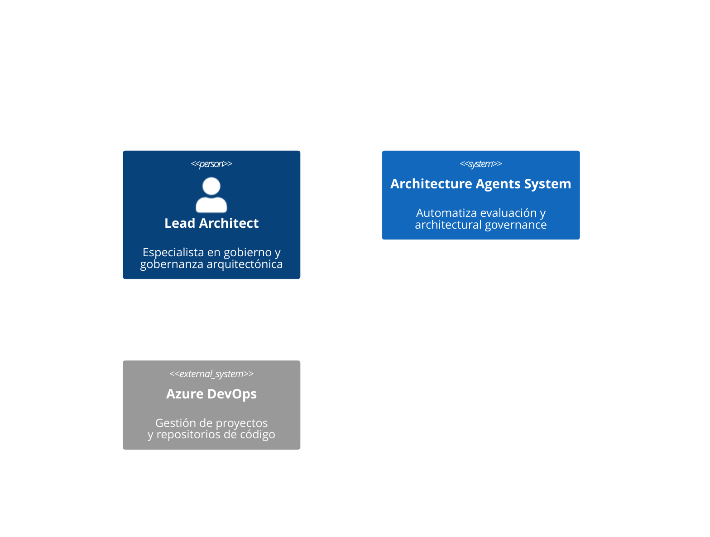
```mermaid
%%{init: {'theme':'base', 'themeVariables': {'background': '#ffffff', 'primaryColor': '#f8f9fa', 'primaryTextColor': '#212529', 'primaryBorderColor': '#dee2e6', 'lineColor': '#6c757d'}}}%%
C4Context
    Person(lead_architect, "Lead Architect", "Especialista en gobierno y<br/>gobernanza arquitectónica")
    System(arch_agents, "Architecture Agents System", "Automatiza evaluación y<br/>architectural governance")
    System_Ext(azure_devops, "Azure DevOps", "Gestión de proyectos<br/>y repositorios de código")
```

</div>

**C4Container:**
<div style="background-color: white; padding: 20px; border-radius: 8px; border: 1px solid #dee2e6;">

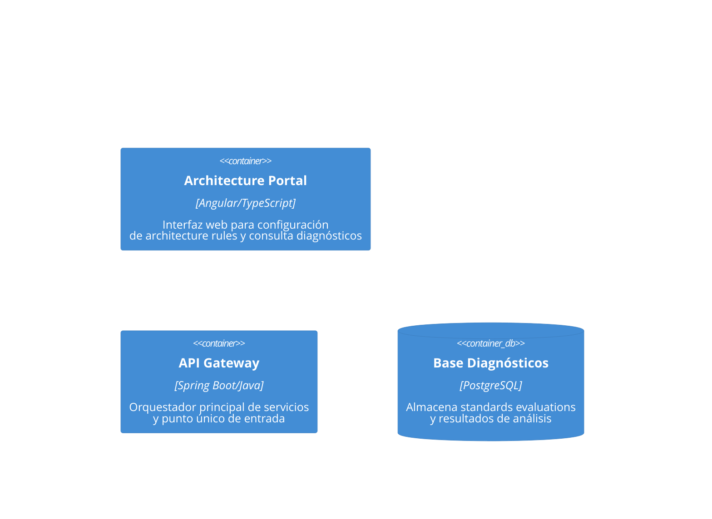
```mermaid
%%{init: {'theme':'base', 'themeVariables': {'background': '#ffffff', 'primaryColor': '#f8f9fa', 'primaryTextColor': '#212529', 'primaryBorderColor': '#dee2e6', 'lineColor': '#6c757d'}}}%%
C4Container
    Container(web_app, "Architecture Portal", "Angular/TypeScript", "Interfaz web para configuración<br/>de architecture rules y consulta diagnósticos")
    Container(api_gateway, "API Gateway", "Spring Boot/Java", "Orquestador principal de servicios<br/>y punto único de entrada")
    ContainerDb(diagnosticos_db, "Base Diagnósticos", "PostgreSQL", "Almacena standards evaluations<br/>y resultados de análisis")
```

</div>

**C4Component:**
<div style="background-color: white; padding: 20px; border-radius: 8px; border: 1px solid #dee2e6;">

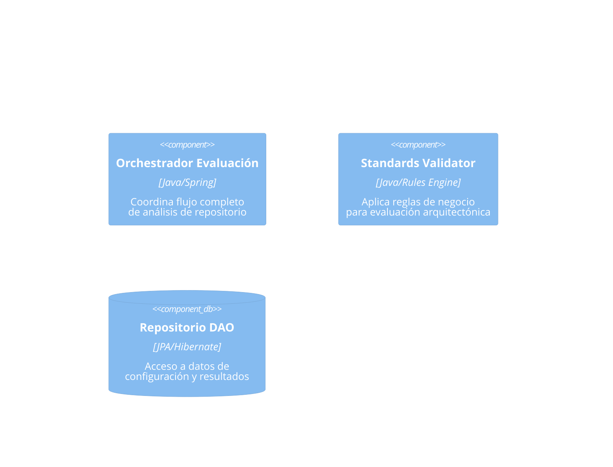
```mermaid
%%{init: {'theme':'base', 'themeVariables': {'background': '#ffffff', 'primaryColor': '#f8f9fa', 'primaryTextColor': '#212529', 'primaryBorderColor': '#dee2e6', 'lineColor': '#6c757d'}}}%%
C4Component
    Component(orchestrator, "Orchestrador Evaluación", "Java/Spring", "Coordina flujo completo<br/>de análisis de repositorio")
    Component(standards_validator, "Standards Validator", "Java/Rules Engine", "Aplica reglas de negocio<br/>para evaluación arquitectónica")
    ComponentDb(repo_dao, "Repositorio DAO", "JPA/Hibernate", "Acceso a datos de<br/>configuración y resultados")
```

</div>

**C4Dynamic:**
<div style="background-color: white; padding: 20px; border-radius: 8px; border: 1px solid #dee2e6;">

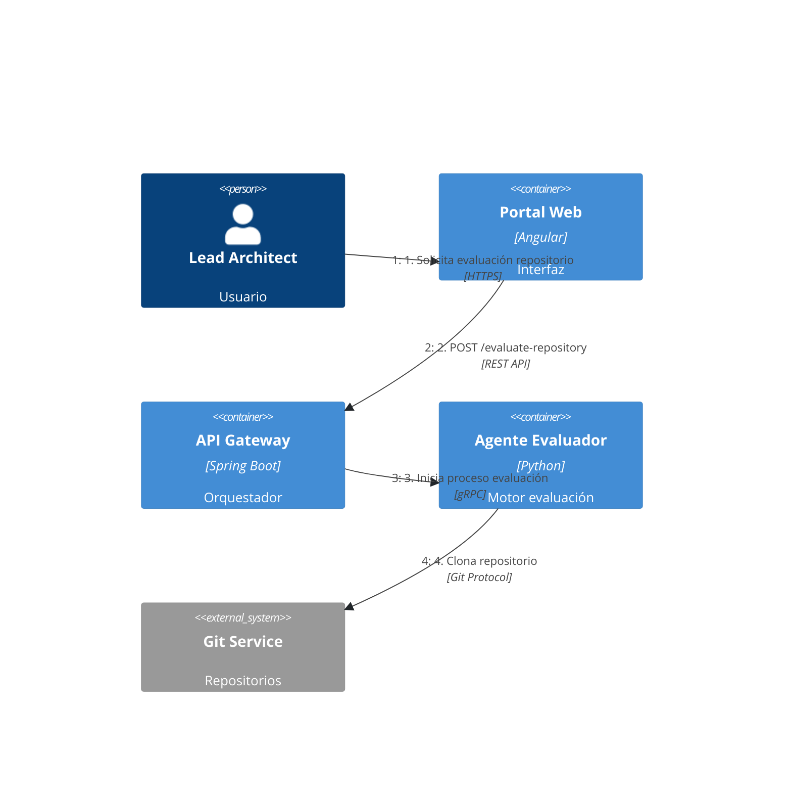
```mermaid
%%{init: {'theme':'base', 'themeVariables': {'background': '#ffffff', 'primaryColor': '#f8f9fa', 'primaryTextColor': '#212529', 'primaryBorderColor': '#dee2e6', 'lineColor': '#6c757d'}}}%%
C4Dynamic
    Person(lead_architect, "Lead Architect", "Usuario")
    Container(web_app, "Portal Web", "Angular", "Interfaz")
    Container(api_gateway, "API Gateway", "Spring Boot", "Orquestador")
    Container(agente_evaluador, "Agente Evaluador", "Python", "Motor evaluación")
    System_Ext(git_service, "Git Service", "Repositorios")
    
    Rel(lead_architect, web_app, "1. Solicita evaluación repositorio", "HTTPS")
    Rel(web_app, api_gateway, "2. POST /evaluate-repository", "REST API")
    Rel(api_gateway, agente_evaluador, "3. Inicia proceso evaluación", "gRPC")
    Rel(agente_evaluador, git_service, "4. Clona repositorio", "Git Protocol")
```

</div>

##### **2. Relaciones detalladas:**
- **Formato**: `Rel(origen, destino, "Descripción de la acción", "Protocolo/Tecnología")`
- **Descripción**: Explicar claramente qué hace la relación, usando `<br/>` para acciones múltiples
- **Protocolo**: Especificar la tecnología de comunicación (HTTPS, REST API, SQL, etc.)

**Ejemplos correctos por nivel:**

**C4Context:**
<div style="background-color: white; padding: 20px; border-radius: 8px; border: 1px solid #dee2e6;">

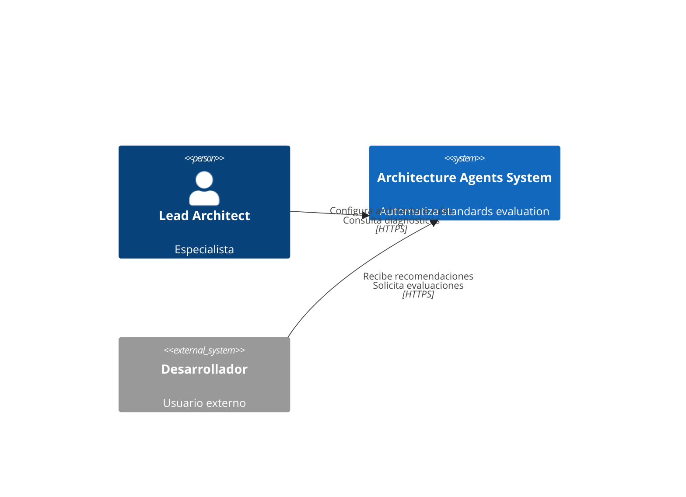
```mermaid
%%{init: {'theme':'base', 'themeVariables': {'background': '#ffffff', 'primaryColor': '#f8f9fa', 'primaryTextColor': '#212529', 'primaryBorderColor': '#dee2e6', 'lineColor': '#6c757d'}}}%%
C4Context
    Person(lead_architect, "Lead Architect", "Especialista")
    System(arch_agents, "Architecture Agents System", "Automatiza standards evaluation")
    System_Ext(developer, "Desarrollador", "Usuario externo")
    
    Rel(lead_architect, arch_agents, "Configura architecture rules<br/>Consulta diagnósticos", "HTTPS")
    Rel(developer, arch_agents, "Recibe recomendaciones<br/>Solicita evaluaciones", "HTTPS")
```

</div>

**C4Container:**
<div style="background-color: white; padding: 20px; border-radius: 8px; border: 1px solid #dee2e6;">

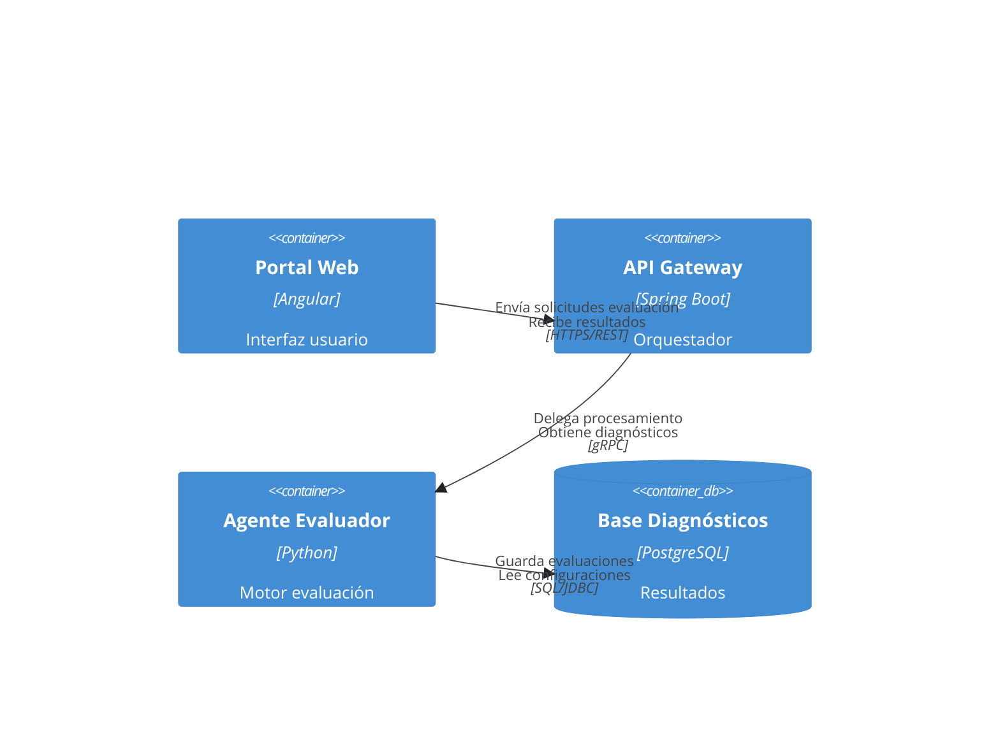
```mermaid
%%{init: {'theme':'base', 'themeVariables': {'background': '#ffffff', 'primaryColor': '#f8f9fa', 'primaryTextColor': '#212529', 'primaryBorderColor': '#dee2e6', 'lineColor': '#6c757d'}}}%%
C4Container
    Container(web_app, "Portal Web", "Angular", "Interfaz usuario")
    Container(api_gateway, "API Gateway", "Spring Boot", "Orquestador")
    Container(agente_evaluador, "Agente Evaluador", "Python", "Motor evaluación")
    ContainerDb(diagnosticos_db, "Base Diagnósticos", "PostgreSQL", "Resultados")
    
    Rel(web_app, api_gateway, "Envía solicitudes evaluación<br/>Recibe resultados", "HTTPS/REST")
    Rel(api_gateway, agente_evaluador, "Delega procesamiento<br/>Obtiene diagnósticos", "gRPC")
    Rel(agente_evaluador, diagnosticos_db, "Guarda evaluaciones<br/>Lee configuraciones", "SQL/JDBC")
```

</div>

**C4Component:**
<div style="background-color: white; padding: 20px; border-radius: 8px; border: 1px solid #dee2e6;">

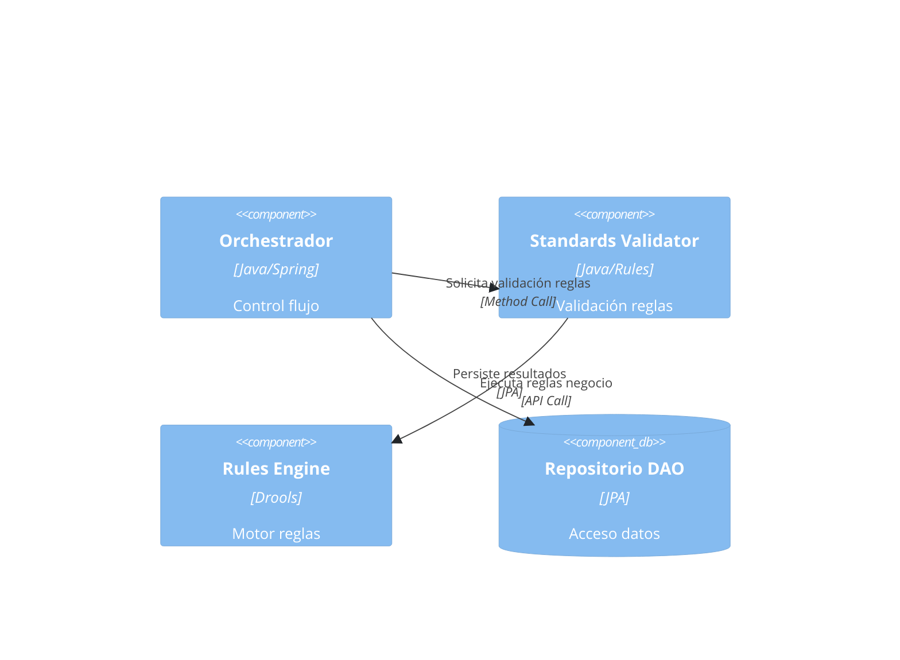
```mermaid
%%{init: {'theme':'base', 'themeVariables': {'background': '#ffffff', 'primaryColor': '#f8f9fa', 'primaryTextColor': '#212529', 'primaryBorderColor': '#dee2e6', 'lineColor': '#6c757d'}}}%%
C4Component
    Component(orchestrator, "Orchestrador", "Java/Spring", "Control flujo")
    Component(standards_validator, "Standards Validator", "Java/Rules", "Validación reglas")
    Component(rules_engine, "Rules Engine", "Drools", "Motor reglas")
    ComponentDb(repo_dao, "Repositorio DAO", "JPA", "Acceso datos")
    
    Rel(orchestrator, standards_validator, "Solicita validación reglas", "Method Call")
    Rel(standards_validator, rules_engine, "Ejecuta reglas negocio", "API Call")
    Rel(orchestrator, repo_dao, "Persiste resultados", "JPA")
```

</div>

**C4Dynamic:**
<div style="background-color: white; padding: 20px; border-radius: 8px; border: 1px solid #dee2e6;">

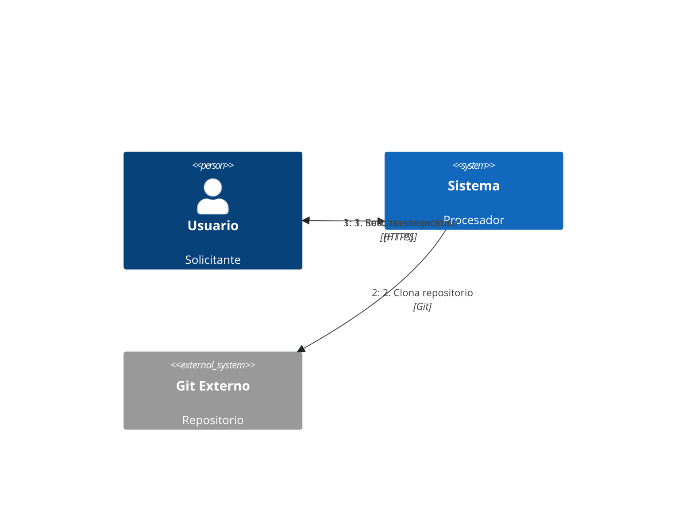
```mermaid
%%{init: {'theme':'base', 'themeVariables': {'background': '#ffffff', 'primaryColor': '#f8f9fa', 'primaryTextColor': '#212529', 'primaryBorderColor': '#dee2e6', 'lineColor': '#6c757d'}}}%%
C4Dynamic
    Person(user, "Usuario", "Solicitante")
    System(system, "Sistema", "Procesador")
    System_Ext(external_git, "Git Externo", "Repositorio")
    
    Rel(user, system, "1. Solicita evaluación", "HTTPS")
    Rel(system, external_git, "2. Clona repositorio", "Git")
    Rel(system, user, "3. Retorna diagnóstico", "HTTPS")
```

</div>

##### **3. Documentación complementaria obligatoria:**
- **SIEMPRE incluir** una sección posterior al diagrama con descripciones detalladas de cada componente
- **Formato estándar por nivel**:

**Para C4Context:**
```
## Descripción de sistemas y actores

### 1. [Nombre del Sistema/Actor]
- **Propósito**: Responsabilidad principal en el ecosistema
- **Usuarios objetivo**: Quién interactúa con este sistema
- **Capacidades clave**: Funcionalidades principales que ofrece
- **Interfaces**: Cómo se comunica con otros sistemas
```

**Para C4Container:**
```
## Descripción de contenedores

### 1. [Nombre del Contenedor]
- **Propósito**: Responsabilidad específica dentro del sistema
- **Tecnología**: Stack tecnológico con justificación
- **Funcionalidades**:
  - Lista detallada de capacidades
  - APIs o interfaces que expone
- **Datos**: Qué información maneja
- **Escalabilidad**: Consideraciones de despliegue
```

**Para C4Component:**
```
## Descripción de componentes

### 1. [Nombre del Componente]
- **Propósito**: Responsabilidad específica dentro del contenedor
- **Patrón**: Patrón de diseño implementado (Repository, Service, etc.)
- **Funcionalidades**:
  - Métodos o operaciones principales
  - Lógica de negocio que implementa
- **Dependencias**: Otros componentes que requiere
- **Tecnología**: Frameworks o librerías específicas
```

**Para C4Dynamic:**
```
## Descripción del flujo

### Flujo: [Nombre del Caso de Uso]
- **Trigger**: Qué inicia este flujo
- **Actores**: Quién participa en el proceso
- **Pasos principales**:
  1. Descripción detallada del paso 1
  2. Descripción detallada del paso 2
  3. [Continuar secuencia...]
- **Datos intercambiados**: Qué información se transmite
- **Condiciones de éxito**: Cuándo se considera completado
- **Manejo de errores**: Qué pasa si algo falla
```

#### Convención de colores para C4:

##### Colores por tipo de elemento C4:
- **Sistema principal/Interno**: `fill:#2563eb,stroke:#1d4ed8,color:#ffffff`
- **Sistemas externos**: `fill:#64748b,stroke:#475569,color:#ffffff`
- **Personas/Actores**: `fill:#16a34a,stroke:#15803d,color:#ffffff`
- **Contenedores web/UI**: `fill:#3b82f6,stroke:#2563eb,color:#ffffff`
- **APIs/Servicios**: `fill:#ea580c,stroke:#c2410c,color:#ffffff`
- **Base de datos**: `fill:#7c3aed,stroke:#6d28d9,color:#ffffff`
- **Colas/Eventos**: `fill:#0891b2,stroke:#0e7490,color:#ffffff`
- **Contenedores críticos**: `fill:#dc2626,stroke:#b91c1c,color:#ffffff`

##### Aplicación por nivel C4:

**C4Context:**
- Sistemas internos: Azul principal (`#2563eb`)
- Sistemas externos: Gris (`#64748b`)
- Personas: Verde (`#16a34a`)

**C4Container:**
- Apps web/UI: Azul claro (`#3b82f6`)
- APIs/Microservicios: Naranja (`#ea580c`)
- Bases de datos: Púrpura (`#7c3aed`)
- Contenedores externos: Gris (`#64748b`)

**C4Component:**
- Componentes lógica: Azul principal (`#2563eb`)
- Componentes datos: Púrpura (`#7c3aed`)
- Componentes comunicación: Cian (`#0891b2`)
- Componentes críticos: Rojo (`#dc2626`)

**C4Dynamic:**
- Colores heredados del nivel de elementos utilizados
- Enfoque en claridad del flujo secuencial

### Para procesos y casos de uso:
- **flowchart TB** (Top to Bottom) para procesos lineales y casos de uso de agentes
- **flowchart LR** (Left to Right) para flujos horizontales y pipelines
- Usar conectores direccionales (`-->`) para mostrar flujo de datos/control

### Para arquitectura (cuando C4 no es aplicable):
- **graph TD** para arquitecturas de componentes simples
- **graph LR** para mostrar relaciones entre módulos

### Para procesos y flujos de trabajo:
- **sequenceDiagram** para interacciones entre actores/sistemas a lo largo del tiempo
- **stateDiagram-v2** para ciclos de vida, estados de aplicaciones o procesos de gobierno
- Usar emojis y notas descriptivas para mayor claridad visual

### Para cronologías y dependencias:
- **gantt** para cronogramas de proyecto y roadmaps
- **flowchart TB** con nodos temporales para timelines simples
- **timeline** para evolución temporal (donde esté soportado)

### Para datos y decisiones:
- **flowchart TD** con nodos de decisión (rombo) para árboles de decisión
- **graph** para modelos de datos y relaciones

## Selección del tipo de diagrama

### Criterios de selección:
1. **¿Representa arquitectura de sistema?** → Usar **C4**
2. **¿Muestra un proceso secuencial?** → Usar **flowchart TB/LR**
3. **¿Documenta interacciones temporales entre actores?** → Usar **sequenceDiagram**
4. **¿Representa estados y transiciones de un proceso?** → Usar **stateDiagram-v2**
5. **¿Documenta decisiones o flujos condicionales?** → Usar **flowchart** con nodos de decisión
6. **¿Presenta cronología o roadmap?** → Usar **gantt** o **flowchart TB** con nodos temporales
7. **¿Muestra relaciones entre entidades?** → Usar **graph**

### Principio general:
**Elegir el tipo de diagrama que brinde mayor CLARIDAD sobre la información presentada**, priorizando C4 para arquitectura y flowchart para procesos.

## Ejemplos completos por nivel C4

### Ejemplo C4Context - Sistema de Architecture Agents:

<div style="background-color: white; padding: 20px; border-radius: 8px; border: 1px solid #dee2e6;">

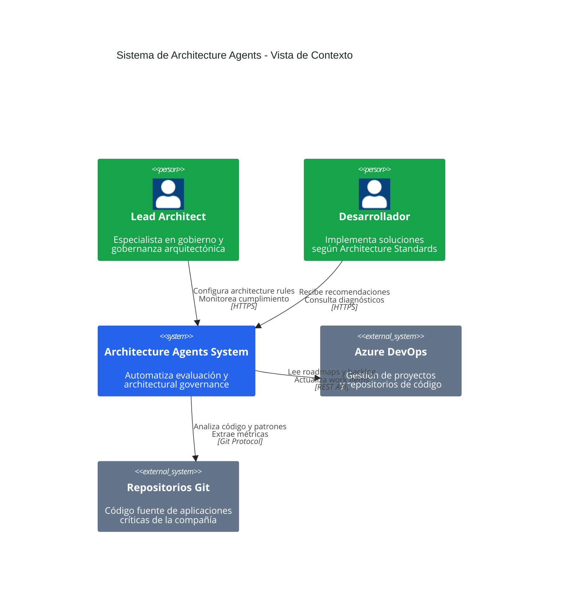
```mermaid
%%{init: {'theme':'base', 'themeVariables': {'background': '#ffffff', 'primaryColor': '#f8f9fa', 'primaryTextColor': '#212529', 'primaryBorderColor': '#dee2e6', 'lineColor': '#6c757d'}}}%%
C4Context
    title Sistema de Architecture Agents - Vista de Contexto
    
    Person(arquitecto, "Lead Architect", "Especialista en gobierno y<br/>gobernanza arquitectónica")
    Person(developer, "Desarrollador", "Implementa soluciones<br/>según Architecture Standards")
    
    System(arch_agents, "Architecture Agents System", "Automatiza evaluación y<br/>architectural governance")
    System_Ext(azure_devops, "Azure DevOps", "Gestión de proyectos<br/>y repositorios de código")
    System_Ext(repositorios, "Repositorios Git", "Código fuente de aplicaciones<br/>críticas de la compañía")
    
    Rel(arquitecto, arch_agents, "Configura architecture rules<br/>Monitorea cumplimiento", "HTTPS")
    Rel(developer, arch_agents, "Recibe recomendaciones<br/>Consulta diagnósticos", "HTTPS")
    Rel(arch_agents, azure_devops, "Lee roadmaps y backlog<br/>Actualiza work items", "REST API")
    Rel(arch_agents, repositorios, "Analiza código y patrones<br/>Extrae métricas", "Git Protocol")
    
    UpdateElementStyle(arch_agents, $bgColor="#2563eb", $fontColor="#ffffff", $borderColor="#1d4ed8")
    UpdateElementStyle(azure_devops, $bgColor="#64748b", $fontColor="#ffffff", $borderColor="#475569")
    UpdateElementStyle(repositorios, $bgColor="#64748b", $fontColor="#ffffff", $borderColor="#475569")
    UpdateElementStyle(arquitecto, $bgColor="#16a34a", $fontColor="#ffffff", $borderColor="#15803d")
    UpdateElementStyle(developer, $bgColor="#16a34a", $fontColor="#ffffff", $borderColor="#15803d")
```

</div>

#### Descripción de sistemas y actores

##### 1. Architecture Agents System
- **Propósito**: Automatizar la evaluación de standards compliance y generar roadmaps de modernización
- **Usuarios objetivo**: Arquitectos ArchTeam, desarrolladores, líderes técnicos
- **Capacidades clave**: Evaluación automática ArchBaseline, generación roadmaps, monitoreo continuo
- **Interfaces**: Portal web, APIs REST, integraciones Git y Azure DevOps

##### 2. Lead Architect
- **Propósito**: Gobierno y gobernanza arquitectónica corporativa
- **Usuarios objetivo**: Equipos de desarrollo, líderes técnicos
- **Capacidades clave**: Configuración architecture rules, monitoreo cumplimiento, análisis diagnósticos
- **Interfaces**: Portal web ArchTeam, dashboards de métricas

### Ejemplo C4Container - Sistema de Architecture Agents:

<div style="background-color: white; padding: 20px; border-radius: 8px; border: 1px solid #dee2e6;">

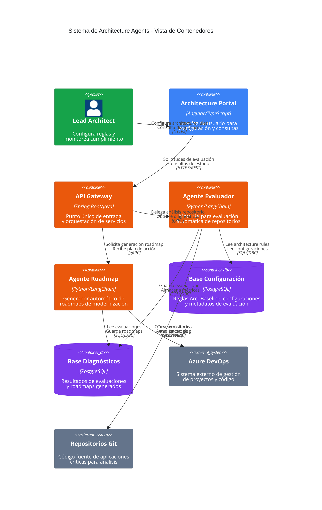
```mermaid
%%{init: {'theme':'base', 'themeVariables': {'background': '#ffffff', 'primaryColor': '#f8f9fa', 'primaryTextColor': '#212529', 'primaryBorderColor': '#dee2e6', 'lineColor': '#6c757d'}}}%%
C4Container
    title Sistema de Architecture Agents - Vista de Contenedores
    
    Person(arquitecto, "Lead Architect", "Configura reglas y<br/>monitorea cumplimiento")
    
    Container(web_portal, "Architecture Portal", "Angular/TypeScript", "Interfaz de usuario para<br/>configuración y consultas")
    Container(api_gateway, "API Gateway", "Spring Boot/Java", "Punto único de entrada<br/>y orquestación de servicios")
    Container(agente_evaluador, "Agente Evaluador", "Python/LangChain", "Motor IA para evaluación<br/>automática de repositorios")
    Container(agente_roadmap, "Agente Roadmap", "Python/LangChain", "Generador automático de<br/>roadmaps de modernización")
    ContainerDb(config_db, "Base Configuración", "PostgreSQL", "Reglas ArchBaseline, configuraciones<br/>y metadatos de evaluación")
    ContainerDb(diagnosticos_db, "Base Diagnósticos", "PostgreSQL", "Resultados de evaluaciones<br/>y roadmaps generados")
    
    System_Ext(azure_devops, "Azure DevOps", "Sistema externo de gestión<br/>de proyectos y código")
    System_Ext(git_repos, "Repositorios Git", "Código fuente de aplicaciones<br/>críticas para análisis")
    
    Rel(arquitecto, web_portal, "Configura architecture rules<br/>Consulta diagnósticos", "HTTPS")
    Rel(web_portal, api_gateway, "Solicitudes de evaluación<br/>Consultas de estado", "HTTPS/REST")
    Rel(api_gateway, agente_evaluador, "Delega análisis repositorio<br/>Obtiene diagnósticos", "gRPC")
    Rel(api_gateway, agente_roadmap, "Solicita generación roadmap<br/>Recibe plan de acción", "gRPC")
    Rel(agente_evaluador, config_db, "Lee architecture rules<br/>Lee configuraciones", "SQL/JDBC")
    Rel(agente_evaluador, diagnosticos_db, "Guarda evaluaciones<br/>Almacena métricas", "SQL/JDBC")
    Rel(agente_roadmap, diagnosticos_db, "Lee evaluaciones<br/>Guarda roadmaps", "SQL/JDBC")
    Rel(agente_evaluador, git_repos, "Clona repositorios<br/>Analiza código", "Git Protocol")
    Rel(agente_roadmap, azure_devops, "Crea work items<br/>Actualiza backlog", "REST API")
    
    UpdateElementStyle(web_portal, $bgColor="#3b82f6", $fontColor="#ffffff", $borderColor="#2563eb")
    UpdateElementStyle(api_gateway, $bgColor="#ea580c", $fontColor="#ffffff", $borderColor="#c2410c")
    UpdateElementStyle(agente_evaluador, $bgColor="#ea580c", $fontColor="#ffffff", $borderColor="#c2410c")
    UpdateElementStyle(agente_roadmap, $bgColor="#ea580c", $fontColor="#ffffff", $borderColor="#c2410c")
    UpdateElementStyle(config_db, $bgColor="#7c3aed", $fontColor="#ffffff", $borderColor="#6d28d9")
    UpdateElementStyle(diagnosticos_db, $bgColor="#7c3aed", $fontColor="#ffffff", $borderColor="#6d28d9")
    UpdateElementStyle(azure_devops, $bgColor="#64748b", $fontColor="#ffffff", $borderColor="#475569")
    UpdateElementStyle(git_repos, $bgColor="#64748b", $fontColor="#ffffff", $borderColor="#475569")
    UpdateElementStyle(arquitecto, $bgColor="#16a34a", $fontColor="#ffffff", $borderColor="#15803d")
```

</div>

#### Descripción de contenedores

##### 1. Architecture Portal
- **Propósito**: Interfaz de usuario principal para interacción con el sistema
- **Tecnología**: Angular/TypeScript con Material Design para UX consistente
- **Funcionalidades**:
  - Configuración de architecture rules por tipo de aplicación
  - Dashboard de métricas y estado de cumplimiento
  - Consulta de diagnósticos y roadmaps generados
  - Gestión de configuraciones y usuarios
- **Datos**: Configuraciones UI, sesiones usuario, cache de consultas
- **Escalabilidad**: SPA desplegada en CDN con balanceador de carga

##### 2. API Gateway  
- **Propósito**: Orquestador principal y punto único de entrada al sistema
- **Tecnología**: Spring Boot/Java con Spring Cloud Gateway para alta performance
- **Funcionalidades**:
  - Ruteo y load balancing hacia agentes especializados
  - Autenticación y autorización centralizada
  - Rate limiting y circuit breaker patterns
  - Logging y monitoreo de transacciones
- **Datos**: Logs de transacciones, métricas de performance
- **Escalabilidad**: Contenedor escalable horizontalmente con Redis para sesiones

### Ejemplo C4Component - Agente Evaluador:

<div style="background-color: white; padding: 20px; border-radius: 8px; border: 1px solid #dee2e6;">

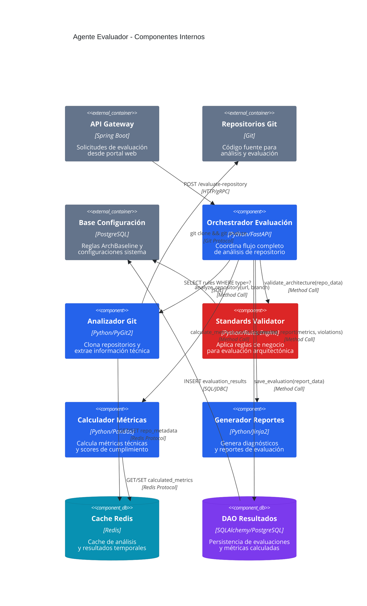
```mermaid
%%{init: {'theme':'base', 'themeVariables': {'background': '#ffffff', 'primaryColor': '#f8f9fa', 'primaryTextColor': '#212529', 'primaryBorderColor': '#dee2e6', 'lineColor': '#6c757d'}}}%%
C4Component
    title Agente Evaluador - Componentes Internos
    
    Container_Ext(api_gateway, "API Gateway", "Spring Boot", "Solicitudes de evaluación<br/>desde portal web")
    Container_Ext(git_repos, "Repositorios Git", "Git", "Código fuente para<br/>análisis y evaluación")
    Container_Ext(config_db, "Base Configuración", "PostgreSQL", "Reglas ArchBaseline y<br/>configuraciones sistema")
    
    Component(orchestrator, "Orchestrador Evaluación", "Python/FastAPI", "Coordina flujo completo<br/>de análisis de repositorio")
    Component(git_analyzer, "Analizador Git", "Python/PyGit2", "Clona repositorios y<br/>extrae información técnica")
    Component(standards_validator, "Standards Validator", "Python/Rules Engine", "Aplica reglas de negocio<br/>para evaluación arquitectónica")
    Component(metrics_calculator, "Calculador Métricas", "Python/Pandas", "Calcula métricas técnicas<br/>y scores de cumplimiento")
    Component(report_generator, "Generador Reportes", "Python/Jinja2", "Genera diagnósticos<br/>y reportes de evaluación")
    ComponentDb(cache_redis, "Cache Redis", "Redis", "Cache de análisis<br/>y resultados temporales")
    ComponentDb(results_dao, "DAO Resultados", "SQLAlchemy/PostgreSQL", "Persistencia de evaluaciones<br/>y métricas calculadas")
    
    Rel(api_gateway, orchestrator, "POST /evaluate-repository", "HTTP/gRPC")
    Rel(orchestrator, git_analyzer, "analyze_repository(url, branch)", "Method Call")
    Rel(orchestrator, standards_validator, "validate_architecture(repo_data)", "Method Call")
    Rel(orchestrator, metrics_calculator, "calculate_metrics(validation_results)", "Method Call")
    Rel(orchestrator, report_generator, "generate_report(metrics, violations)", "Method Call")
    Rel(git_analyzer, git_repos, "git clone && git analyze", "Git Protocol")
    Rel(standards_validator, config_db, "SELECT rules WHERE type=?", "SQL")
    Rel(git_analyzer, cache_redis, "GET/SET repo_metadata", "Redis Protocol")
    Rel(metrics_calculator, cache_redis, "GET/SET calculated_metrics", "Redis Protocol")
    Rel(results_dao, config_db, "INSERT evaluation_results", "SQL/JDBC")
    Rel(orchestrator, results_dao, "save_evaluation(report_data)", "Method Call")
    
    UpdateElementStyle(orchestrator, $bgColor="#2563eb", $fontColor="#ffffff", $borderColor="#1d4ed8")
    UpdateElementStyle(git_analyzer, $bgColor="#2563eb", $fontColor="#ffffff", $borderColor="#1d4ed8")
    UpdateElementStyle(standards_validator, $bgColor="#dc2626", $fontColor="#ffffff", $borderColor="#b91c1c")
    UpdateElementStyle(metrics_calculator, $bgColor="#2563eb", $fontColor="#ffffff", $borderColor="#1d4ed8")
    UpdateElementStyle(report_generator, $bgColor="#2563eb", $fontColor="#ffffff", $borderColor="#1d4ed8")
    UpdateElementStyle(cache_redis, $bgColor="#0891b2", $fontColor="#ffffff", $borderColor="#0e7490")
    UpdateElementStyle(results_dao, $bgColor="#7c3aed", $fontColor="#ffffff", $borderColor="#6d28d9")
    UpdateElementStyle(api_gateway, $bgColor="#64748b", $fontColor="#ffffff", $borderColor="#475569")
    UpdateElementStyle(git_repos, $bgColor="#64748b", $fontColor="#ffffff", $borderColor="#475569")
    UpdateElementStyle(config_db, $bgColor="#64748b", $fontColor="#ffffff", $borderColor="#475569")
```

</div>

#### Descripción de componentes

##### 1. Orchestrador Evaluación
- **Propósito**: Controlar el flujo completo de evaluación de repositorios
- **Patrón**: Orchestrator Pattern con manejo de transacciones distribuidas
- **Funcionalidades**:
  - Coordinación secuencial de análisis Git → standards validation → métricas → reporte
  - Manejo de errores y rollback en caso de fallas
  - Control de timeouts y límites de procesamiento
- **Dependencias**: Todos los componentes internos del agente
- **Tecnología**: Python/FastAPI con Celery para procesamiento asíncrono

##### 2. Standards Validator
- **Propósito**: Motor crítico que aplica reglas de negocio ArchBaseline sobre código analizado
- **Patrón**: Rules Engine con Strategy Pattern por tipo de aplicación
- **Funcionalidades**:
  - Carga dinámica de reglas desde base de configuración
  - Evaluación de patrones arquitectónicos (Clean Architecture, SOLID, etc.)
  - Detección de violaciones y cálculo de scores de cumplimiento
- **Dependencias**: Base de configuración, cache Redis
- **Tecnología**: Python con librería rules-engine personalizada

### Ejemplo C4Dynamic - Flujo de Evaluación:

<div style="background-color: white; padding: 20px; border-radius: 8px; border: 1px solid #dee2e6;">

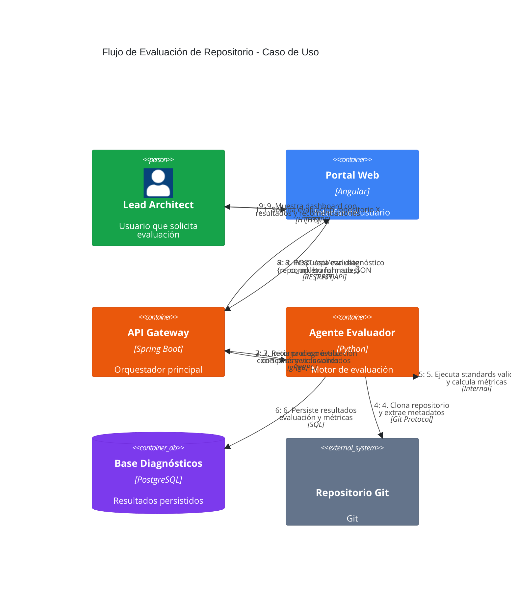
```mermaid
%%{init: {'theme':'base', 'themeVariables': {'background': '#ffffff', 'primaryColor': '#f8f9fa', 'primaryTextColor': '#212529', 'primaryBorderColor': '#dee2e6', 'lineColor': '#6c757d'}}}%%
C4Dynamic
    title Flujo de Evaluación de Repositorio - Caso de Uso
    
    Person(arquitecto, "Lead Architect", "Usuario que solicita<br/>evaluación")
    Container(web_portal, "Portal Web", "Angular", "Interfaz de usuario")
    Container(api_gateway, "API Gateway", "Spring Boot", "Orquestador principal")
    Container(agente_evaluador, "Agente Evaluador", "Python", "Motor de evaluación")
    ContainerDb(diagnosticos_db, "Base Diagnósticos", "PostgreSQL", "Resultados persistidos")
    System_Ext(git_repo, "Repositorio Git", "Git", "Código a evaluar")
    
    Rel(arquitecto, web_portal, "1. Solicita evaluación repositorio X", "HTTPS")
    Rel(web_portal, api_gateway, "2. POST /api/evaluate<br/>{repo_url, branch, rules}", "REST API")
    Rel(api_gateway, agente_evaluador, "3. Inicia proceso evaluación<br/>con parámetros validados", "gRPC")
    Rel(agente_evaluador, git_repo, "4. Clona repositorio<br/>y extrae metadatos", "Git Protocol")
    Rel(agente_evaluador, agente_evaluador, "5. Ejecuta standards validations<br/>y calcula métricas", "Internal")
    Rel(agente_evaluador, diagnosticos_db, "6. Persiste resultados<br/>evaluación y métricas", "SQL")
    Rel(agente_evaluador, api_gateway, "7. Retorna diagnóstico<br/>con scores y violaciones", "gRPC")
    Rel(api_gateway, web_portal, "8. Respuesta con diagnóstico<br/>completo formato JSON", "REST API")
    Rel(web_portal, arquitecto, "9. Muestra dashboard con<br/>resultados y recomendaciones", "HTTPS")
    
    UpdateElementStyle(arquitecto, $bgColor="#16a34a", $fontColor="#ffffff", $borderColor="#15803d")
    UpdateElementStyle(web_portal, $bgColor="#3b82f6", $fontColor="#ffffff", $borderColor="#2563eb")
    UpdateElementStyle(api_gateway, $bgColor="#ea580c", $fontColor="#ffffff", $borderColor="#c2410c")
    UpdateElementStyle(agente_evaluador, $bgColor="#ea580c", $fontColor="#ffffff", $borderColor="#c2410c")
    UpdateElementStyle(diagnosticos_db, $bgColor="#7c3aed", $fontColor="#ffffff", $borderColor="#6d28d9")
    UpdateElementStyle(git_repo, $bgColor="#64748b", $fontColor="#ffffff", $borderColor="#475569")
```

</div>

#### Descripción del flujo

##### Flujo: Evaluación de Repositorio
- **Trigger**: Lead Architect solicita evaluación de repositorio específico desde portal web
- **Actores**: Lead Architect, Architecture Agents System, Repositorio Git externo
- **Pasos principales**:
  1. **Solicitud inicial**: Usuario ingresa URL repositorio, branch y selecciona architecture rules aplicables
  2. **Validación parámetros**: API Gateway valida formato URL, existencia branch y permisos acceso
  3. **Iniciación evaluación**: Se crea job asíncrono en agente evaluador con parámetros validados
  4. **Clonado análisis**: Agente clona repositorio temporalmente y extrae estructura técnica
  5. **Evaluación ArchBaseline**: Motor aplica reglas configuradas y calcula scores de cumplimiento
  6. **Persistencia**: Resultados se guardan en base diagnósticos con timestamp y metadatos
  7. **Respuesta servicio**: Diagnóstico completo retorna via API con formato estructurado
  8. **Presentación usuario**: Portal renderiza dashboard interactivo con métricas y recomendaciones
- **Datos intercambiados**: URL repositorio, configuración reglas, metadatos técnicos, scores cumplimiento, recomendaciones
- **Condiciones de éxito**: Diagnóstico completo generado y persistido, usuario recibe feedback visual
- **Manejo de errores**: Timeout en clonado, repositorio inaccesible, architecture rules inconsistentes

## Ejemplos de aplicación (otros tipos de diagramas)

### Diagrama C4 Context (Preferido para arquitectura):

<div style="background-color: white; padding: 20px; border-radius: 8px; border: 1px solid #dee2e6;">

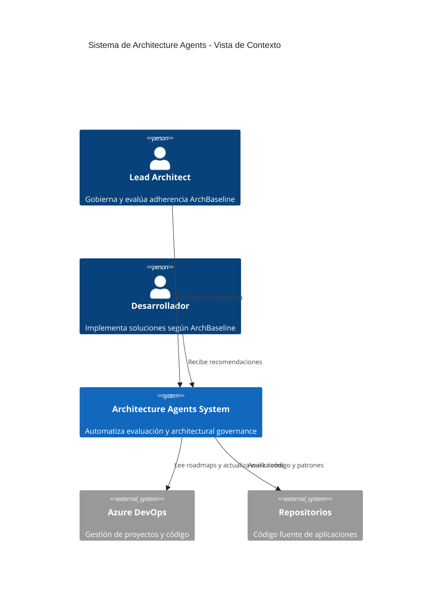
```mermaid
%%{init: {'theme':'base', 'themeVariables': {'background': '#ffffff', 'primaryColor': '#f8f9fa', 'primaryTextColor': '#212529', 'primaryBorderColor': '#dee2e6', 'lineColor': '#6c757d'}}}%%
C4Context
    title Sistema de Architecture Agents - Vista de Contexto
    
    Person(arquitecto, "Lead Architect", "Gobierna y evalúa adherencia ArchBaseline")
    Person(developer, "Desarrollador", "Implementa soluciones según ArchBaseline")
    
    System(arch_agents, "Architecture Agents System", "Automatiza evaluación y architectural governance")
    System_Ext(azure_devops, "Azure DevOps", "Gestión de proyectos y código")
    System_Ext(repositorios, "Repositorios", "Código fuente de aplicaciones")
    
    Rel(arquitecto, arch_agents, "Configura y monitorea")
    Rel(developer, arch_agents, "Recibe recomendaciones")
    Rel(arch_agents, azure_devops, "Lee roadmaps y actualiza work items")
    Rel(arch_agents, repositorios, "Analiza código y patrones")
```

</div>

### Caso de uso con flowchart (Para procesos):

<div style="background-color: white; padding: 20px; border-radius: 8px; border: 1px solid #dee2e6;">

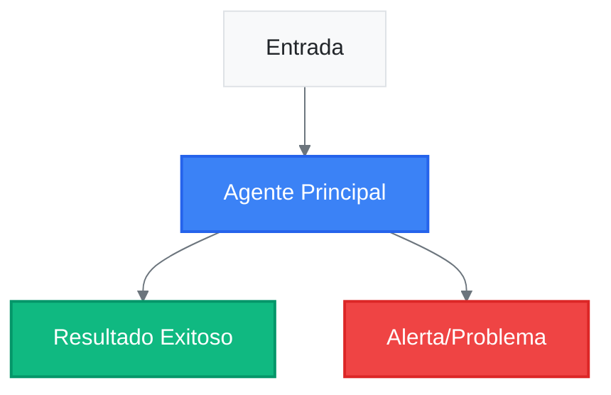
```mermaid
%%{init: {'theme':'base', 'themeVariables': {'background': '#ffffff', 'primaryColor': '#f8f9fa', 'primaryTextColor': '#212529', 'primaryBorderColor': '#dee2e6', 'lineColor': '#6c757d'}}}%%
flowchart TB
    A[Entrada] --> B[Agente Principal]
    B --> C[Resultado Exitoso]
    B --> D[Alerta/Problema]
    
    style B fill:#3b82f6,stroke:#2563eb,stroke-width:2px,color:#ffffff
    style C fill:#10b981,stroke:#059669,stroke-width:2px,color:#ffffff
    style D fill:#ef4444,stroke:#dc2626,stroke-width:2px,color:#ffffff
```

</div>

### Roadmap con gantt (Para cronologías):

<div style="background-color: white; padding: 20px; border-radius: 8px; border: 1px solid #dee2e6;">

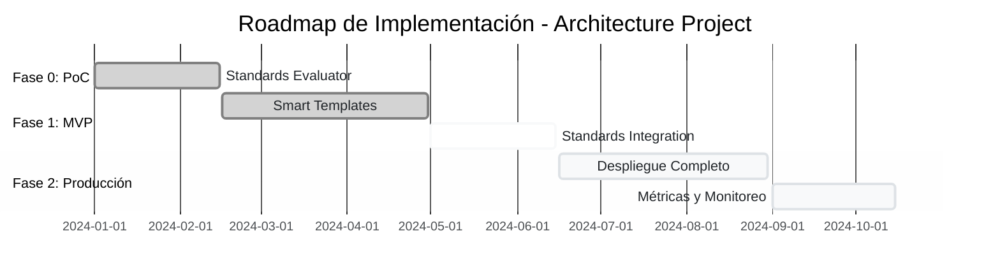
```mermaid
%%{init: {'theme':'base', 'themeVariables': {'background': '#ffffff', 'primaryColor': '#f8f9fa', 'primaryTextColor': '#212529', 'primaryBorderColor': '#dee2e6', 'lineColor': '#6c757d'}}}%%
gantt
    title Roadmap de Implementación - Architecture Project
    dateFormat YYYY-MM-DD
    section Fase 0: PoC
    Standards Evaluator           :done, poc1, 2024-01-01, 2024-02-15
    section Fase 1: MVP
    Smart Templates      :done, mvp1, 2024-02-16, 2024-04-30
    Standards Integration         :active, mvp2, 2024-05-01, 2024-06-15
    section Fase 2: Producción
    Despliegue Completo     :prod1, 2024-06-16, 2024-08-30
    Métricas y Monitoreo    :prod2, 2024-09-01, 2024-10-15
```

</div>

## Validación de cumplimiento

### Checklist obligatorio:
- [ ] Incluye configuración de tema base
- [ ] Envuelto en contenedor HTML con fondo blanco
- [ ] Usa paleta de colores estándar
- [ ] Texto blanco sobre fondos coloridos
- [ ] Contornos definidos con stroke-width:2px
- [ ] Colores semánticamente apropiados
- [ ] Legible en impresión y pantalla
- [ ] Tipo de diagrama apropiado para el contenido (C4 > flowchart > otros)

#### Checklist para prevenir errores de renderizado:
- [ ] **NO usa dos puntos (:) en nombres de secciones de Gantt**
- [ ] **NO usa barras diagonales (/) en nombres de elementos**
- [ ] **NO usa paréntesis en nombres de tareas de Gantt**
- [ ] **NO usa prefijos complejos** (ej: "T1.1:", "CU-001:")
- [ ] **Evita `axisFormat`** en diagramas de Gantt
- [ ] **Usa identificadores alfanuméricos simples** para nodos
- [ ] **Valida sintaxis** en VS Code antes de commit
- [ ] **Simplifica nombres** con múltiples caracteres especiales

#### Checklist para optimización de layout (diagramas complejos):
- [ ] Usa configuración avanzada con dagre/flowchart settings cuando sea necesario
- [ ] Agrupa elementos relacionados usando Boundaries apropiados
- [ ] Declara nodos en orden visual deseado (arriba→abajo, izquierda→derecha)  
- [ ] Usa relaciones direccionales (Rel_D, Rel_R, Rel_L, Rel_U) para controlar flujo
- [ ] Mantiene un diagrama por nivel de abstracción
- [ ] Labels de relaciones son concisos para reducir ancho de reserva
- [ ] Evita mezclar niveles (externos + middleware + servicios + repos en uno)

#### Checklist específico para diagramas C4:
- [ ] Elementos incluyen información detallada (nombre, tecnología, descripción)
- [ ] Relaciones especifican acción clara y protocolo de comunicación
- [ ] Descripciones usan `<br/>` para separar líneas cuando es necesario
- [ ] Incluye sección "Descripción de componentes principales" posterior al diagrama
- [ ] Cada componente tiene propósito, funcionalidades y tecnología documentados
- [ ] Tecnologías específicas mencionadas (ej: "Python/LangChain", "Angular/TypeScript")
- [ ] Protocolos de comunicación especificados (HTTPS, REST API, SQL, etc.)

##### Validaciones específicas por nivel C4:

**C4Context:**
- [ ] Solo usa elementos `Person()`, `System()`, `System_Ext()`
- [ ] Descripciones enfocadas en propósito de negocio, no implementación
- [ ] Relaciones muestran flujos de información de alto nivel
- [ ] Incluye todos los actores externos relevantes
- [ ] Sistema principal claramente identificado y diferenciado

**C4Container:**
- [ ] Usa elementos `Container()`, `Container_Ext()`, `ContainerDb()`
- [ ] Especifica tecnologías concretas (ej: "Spring Boot/Java", "PostgreSQL")
- [ ] Relaciones incluyen protocolos específicos (HTTPS, SQL, gRPC, etc.)
- [ ] Diferencia entre contenedores internos y externos mediante colores
- [ ] Muestra arquitectura de despliegue y comunicación entre servicios

**C4Component:**
- [ ] Usa elementos `Component()`, `ComponentDb()`, `ComponentQueue()`
- [ ] Enfocado en componentes de UN SOLO contenedor
- [ ] Relaciones muestran dependencias internas y llamadas de método
- [ ] Componentes representan responsabilidades específicas (patrón de diseño)
- [ ] Incluye solo dependencias externas esenciales como `Container_Ext()`

**C4Dynamic:**
- [ ] Todas las relaciones están numeradas secuencialmente (1, 2, 3...)
- [ ] Muestra flujo temporal claro de inicio a fin
- [ ] Elementos pueden ser de cualquier nivel (Context, Container, Component)
- [ ] Describe un caso de uso específico y completo
- [ ] Incluye manejo de respuestas y flujos bidireccionales cuando aplique

### Elementos prohibidos:
- ❌ Diagramas sin contenedor de fondo blanco
- ❌ Fondos transparentes o por defecto
- ❌ Texto negro sobre fondos oscuros
- ❌ Colores aleatorios sin semántica
- ❌ Diagramas sin configuración de tema
- ❌ Herramientas diferentes a Mermaid
- ❌ Usar flowchart cuando C4 sería más apropiado para arquitectura

#### Elementos prohibidos para prevenir errores de renderizado:
- ❌ Dos puntos (:) en nombres de secciones de Gantt (causa "Cannot read properties of undefined")
- ❌ Barras diagonales (/) en nombres de elementos (problemático en parsing)
- ❌ Paréntesis en nombres de tareas de Gantt (puede romper sintaxis)
- ❌ Prefijos complejos como "T1.1:", "CU-001:" en nombres (confunde parser)
- ❌ `axisFormat` en diagramas de Gantt (incompatible con algunas versiones)
- ❌ Caracteres especiales múltiples en identificadores de nodos
- ❌ Nombres de elementos excesivamente complejos sin simplificar

#### Elementos prohibidos para optimización de layout:
- ❌ Diagramas complejos sin Boundaries para agrupar elementos relacionados
- ❌ Declaración de nodos en orden aleatorio sin considerar layout visual deseado
- ❌ Uso solo de `Rel()` genérico cuando relaciones direccionales mejorarían el layout
- ❌ Mezclar múltiples niveles de abstracción en un solo diagrama
- ❌ Labels de relaciones excesivamente largos que fuerzan ancho extra de reserva
- ❌ Diagramas complejos sin configuración dagre/flowchart de espaciado

#### Elementos prohibidos específicos para C4:
- ❌ Elementos sin información de tecnología (ej: `Person(id, "Nombre")` sin descripción)
- ❌ Relaciones sin protocolo especificado (ej: `Rel(a, b, "hace algo")` sin "HTTPS")
- ❌ Descripciones genéricas sin detalles específicos
- ❌ Diagramas C4 sin documentación complementaria posterior
- ❌ Componentes sin explicación de propósito y funcionalidades
- ❌ Tecnologías vagas (ej: "Base de datos" en lugar de "PostgreSQL")
- ❌ Uso de pipes `|` en tecnologías sin explicar alternativas (debe ser "Python/LangChain|Java/LangChain4J")

##### Prohibiciones específicas por nivel C4:

**C4Context:**
- ❌ Mostrar detalles de implementación o tecnologías específicas
- ❌ Usar elementos de Container/Component (`Container()`, `Component()`)
- ❌ Relaciones con detalles técnicos de protocolos internos
- ❌ Incluir componentes internos del sistema

**C4Container:**
- ❌ Mostrar componentes internos de contenedores
- ❌ Usar elementos de Component (`Component()`, `ComponentDb()`)
- ❌ Relaciones sin especificar protocolo de comunicación
- ❌ Mezclar niveles de abstracción (mostrar clases o métodos)

**C4Component:**
- ❌ Incluir múltiples contenedores (debe enfocarse en UNO)
- ❌ Mostrar detalles de implementación de código
- ❌ Relaciones sin especificar tipo de dependencia/llamada
- ❌ Elementos que no representen responsabilidades claras

**C4Dynamic:**
- ❌ Relaciones sin numeración secuencial
- ❌ Flujos sin inicio o fin claro
- ❌ Mezclar múltiples casos de uso en un solo diagrama
- ❌ Omitir respuestas o confirmaciones en flujos bidireccionales

## Project Context

Aplicar estos lineamientos especialmente para:
- **Casos de uso de agentes de IA**
- **Arquitecturas de habilitadores**
- **Procesos de gobierno y gobernanza**
- **Flujos de standards evaluation**
- **Roadmaps de implementación**
